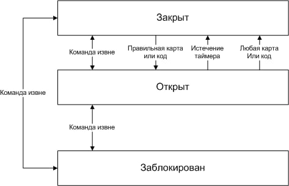

# Замок (лазерная дверь)

[Repository](https://github.com/skaben/device_lock)

### Предназначение:

Обеспечивать ограничение доступа в игровые зоны. Предоставлять возможность доступа если есть карта доступа или код, добытые игроками в ходе игры на внешнем полигоне или внутри самого данжа.

### Игровое взаимодействие:

**Дверь считается закрытой, если горит лазерный луч.** Игроки прикладывают карту к считывателю или вводят код на клавиатуре. Если замок открывается - лазерный луч гаснет на определенное время, давая возможность пройти через дверной проем, затем зажигается вновь. **Закрыть дверь досрочно - можно приложив любую карту повторно или нажав любую кнопку на клавиатуре.** В зависимости от правил игры - дверь может обладать разными эффектами на игрока, но в большинстве случаев - попавший в луч игрок получает тяжелую травму, -HP, или сопоставимый значительный негативный эффект.

### Особенности реализации:

Имеют три игровых статуса. 

- “Закрыт” - статус по умолчанию, включены лазеры, слышен звук работающего защитного поля.
- “Открыт” - лазеры выключены, звуков нет.
- “Заблокирован” - лазеры включены, звук есть, открыть средствами игроков нельзя. Внешне не отличается от “Закрыт”.

<aside>
⚙ Звук контролируется отдельным параметром и может быть при необходимости выключен. О работоспособности двери свидетельствует **исключительно лазерный луч.**

</aside>

В любом из игровых статусов замки действуют в соответствии со своим автоматом состояний на основе access-листа, предназначенного для этого статуса. То есть, при наличии карточки или кода в списке access-листа в данном цветовом статусе - замок открывается на время, указанное в его конфигурации, после чего закрывается обратно. Досрочно замок можно закрыть, приложив ЛЮБУЮ карту, или введя любой код.

В чёрном статусе все замки заблокированы. В белом статусе - все замки открыты.

⚙ В статус “Заблокирован” замок может быть переведён только с сервера, но не действиями игроков. Из статуса “Заблокирован” замок может быть выведён только командой с сервера, но не действиями игроков.

Если замок открывается командой с сервера, таймаут закрытия не взводится, и замок остаётся открытым, пока игроки сами его не закроют, или не придёт команда с сервера на закрытие или блокировку

---

### Концептуальная схема работы, автомат состояний:

