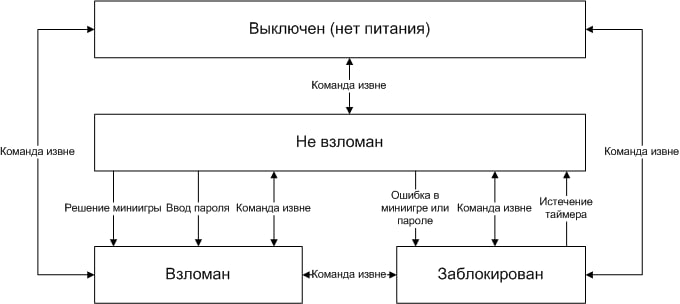

# Терминал

[Curses Repository](https://github.com/skaben/device_curses)

### Предназначение:

Устройство для выдачи игрокам игровой информации, подсказок по прохождению самого данжа и для взаимодействия с локальным и глобальным окружением данжа.

### Процесс игрового взаимодействия:

Основное взаимодействие происходит путём выбора действий из меню на экране ноутбука, а также прохождения миниигры, моделирующей взлом терминала.

### Детали реализации

Терминал - ноутбук со специализированным ПО. Основные игровые статусы - “Не взломан” и “Взломан”. В каждом из этих статусов игрокам показывается некое меню опций, максимальными возможностями игроки должны обладать после достижения статуса “Взломан”. Пункт меню может представлять следующие варианты: 

1. Воспроизведение медиа файла (текст, картинка, звук, видео). 
2. Прямое взаимодействие на окружение данжона (прямая команда в кролика, например) - открыть лазерный замок, изменить общий уровень тревоги, передать команду на открытие ящичка, и т.п. 
3. Вход в режим чата с мозгом базы - оператором данжа.
4. Запуск миниигры (ввод пароля тоже считается миниигрой), успешным результатом прохождения которой может быть смена статуса терминала на “Взломан”, любое действие из пунктов 1, 2 или 3. Не успешное прохождение миниигры может приводить к переходу терминала в состояние “Заблокирован” или “Не взломан”, оставлению в текущем статусе, ухудшению уровня тревоги.

### Автомат состояний терминала:

